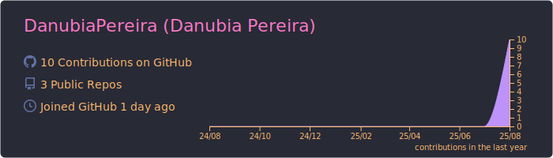
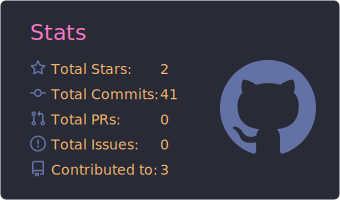

<h1 align="center">👋 Olá, eu sou a Danubia Pereira!</h1>

  
  
  
  

  

---

### Sobre mim
Analista de Dados em transição, apaixonada por transformar dados brutos em **insights de negócio**.  
Foco em **SQL avançado** (CTEs, Window Functions) e **Python** (Pandas/Plotly) para análise e visualização.  
Busco oportunidades **estágio/júnior** para colaborar, aprender e gerar valor.

---

### 🧰 Stack & Ferramentas

  
  
  
   
  
  
  

---

### 🚀 Meus Principais Projetos

  
  

---

### 📊 Métricas do GitHub

  

  

  
  
  

  

  <picture>
    <picture> <source media="(prefers-color-scheme: dark)" srcset="https://raw.githubusercontent.com/Platane/snk/output/github-contribution-grid-snake-dark.svg">  </picture> 

---

### 🏆 Troféus

  

